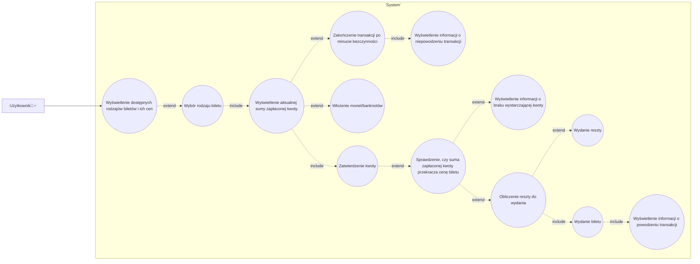
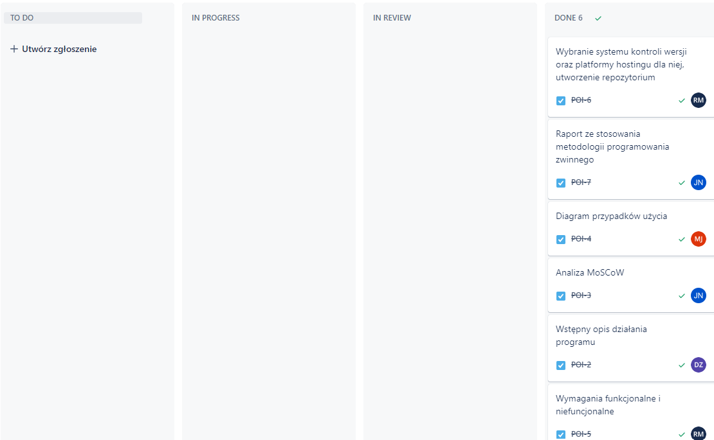

# **Programowanie obiektowe**

## Temat: Symulator automatu biletowego

**Członkowie zespołu:**

Rafał Majchrowicz

Mirosław Jachowicz

Jakub Nykiel

Damian Zawisza

## Etap I:

### **1.Wstępny opis działania programu.**

Aplikacja ma za zadanie symulować działanie automatu biletowego wzorowanego na automatach MPK. Użytkownik powinien mieć wybór wybrania biletu, a następnie możliwość zapłaty monetami i gotówką o różnym nominale. Gdy nastąpi poprawna zapłata (ilość gotówki wrzuconej przekroczy cenę biletów) automat powinien wydać resztę wraz z biletem. Jeśli nie zostanie wrzucona gotówka przez określny czas (np. minutę), automat powinien wrócić do stanu startowego oraz oddać wrzuconą gotówkę, jeśli taka była.

### **2. Analiza MoSCoW.**

**Must have:**

- Wybór biletu: Użytkownik powinien móc wybrać rodzaj biletu spośród dostępnych opcji.
- Akceptacja monet i banknotów: Automat powinien akceptować monety i banknoty o różnych nominałach jako formę płatności.
- Wydawanie biletów: Po poprawnej zapłacie automat powinien wydać bilet.
- Wydawanie reszty: Jeśli wrzucona kwota przekroczy cenę biletu, automat powinien wydać resztę.

**Should have:**

- Obsługa błędnych wpłat: Automat powinien reagować na błędne wpłaty, informując użytkownika o konieczności wrzucenia odpowiedniej kwoty.
- Wyświetlanie ceny biletu: Przed dokonaniem płatności automat powinien wyświetlić użytkownikowi cenę wybranego biletu.
- Zwrot wrzuconej gotówki: Jeśli użytkownik zrezygnuje z zakupu biletu, automat powinien zwrócić wrzucone pieniądze.

**Could have:**

- Obsługa płatności bezgotówkowych: Dodanie opcji płatności kartą lub przez aplikację mobilną.

**Won't have:**

- Integracja z systemem zarządzania MPK: Rozbudowa aplikacji o możliwość sprawdzania rozkładów jazdy czy zakupu biletów okresowych.
- Obsługa karty miejskiej: Możliwość sprawdzenia aktualnego statusu.

### **3. Diagram przypadków użycia wraz ze szczegółowym opisem.**

#### **Opis przypadków użycia:**  
**Nazwa przypadku:** Wyświetlenie dostępnych rodzajów biletów i ich cen  
**Aktor:** Użytkownik  
**Wyzwalacz:** Uruchomienie aplikacji  
**Scenariusz główny:**  
**1.** System wyświetla aktorowi ekran startowy zawierający informacje o rodzaju oraz cenie biletów  

**Nazwa przypadku:** Wybór rodzaju biletu  
**Aktor:** Użytkownik  
**Wyzwalacz:** Naciśniecie przycisku znajdującego się obok wybranego biletu  
**Scenariusz główny:**  
**1.** Aktor naciska odpowiedni przycisk  
**2.** System wyświetla aktorowi interfejs płatności

**Nazwa przypadku:** Wyświetlenie aktualnej sumy zapłaconej kwoty  
**Aktor:** Użytkownik  
**Wyzwalacz:** Aktor znajduje się w interfejsie płatności  
**Scenariusz główny:**  
**1.** System wyświetla informacje o wysokości aktualnie zapłaconej kwoty

**Nazwa przypadku:** Zakończenie transakcji po minucie bezczynności  
**Aktor:** Użytkownik  
**Wyzwalacz:** Aktor po naciśnieciu przycisku wyboru rodzaju biletu, nie wykonał żadnych działań przez minutę  
**Scenariusz główny:**  
**1.** System oblicza czas od ostatniej wykonanej aktywności  
**2.** System zmienia interfejs płatności na główny interfejs aplikacji

**Nazwa przypadku:** Wyświetlenie informacji o niepowodzeniu transakcji  
**Aktor:** Użytkownik  
**Wyzwalacz:** System zakończył transakcje przez brak aktywności  
**Scenariusz główny:**  
**1.** System wyświetla aktorowi informacje o niepowodzeniu transakcji

**Nazwa przypadku:** Włożenie monet/banknotów  
**Aktor:** Użytkownik  
**Wyzwalacz:** Aktor znajduje się w interfejsie płatności  
**Scenariusz główny:**  
**1.** Aktor wybiera odpowiedni nominał  
**2.** Aktor przeciąga wybrany nominał na automat biletowy

**Nazwa przypadku:** Zatwierdzenie kwoty  
**Aktor:** Użytkownik  
**Wyzwalacz:** Aktor znajduje się w interfejsie płatności  
**Scenariusz główny:**  
**1.** Aktor naciska przycisk odpowiedzialny za zatwierdzenie kwoty

**Nazwa przypadku:** Sprawdzenie, czy suma zapłaconej kwoty przekracza cenę biletu  
**Aktor:** Użytkownik  
**Wyzwalacz:** Aktor nacisnął przycisk odpowiednialny za zatwierdzenie kwoty  
**Scenariusz główny:**  
**1.** System porównuje wprowadzoną kwotę z ceną przypisaną do wybranego biletu

**Nazwa przypadku:** Wyświetlenie informacji o braku wystarczającej kwoty  
**Aktor:** Użytkownik  
**Wyzwalacz:** Kwota wprowadzonaa przez użytkownika jest niższa niż cena wybranego biletu  
**Scenariusz główny:**  
**1.** System wyświetla aktorowi informację o niewystarczającej kwocie

**Nazwa przypadku:** Obliczenie reszty do wydania  
**Aktor:** Użytkownik  
**Wyzwalacz:** Kwota wprowadzonaa przez użytkownika jest wyższa niż cena wybranego biletu  
**Scenariusz główny:**  
**1.** System oblicza kwotę, którą musi wydać użytkownikowi

**Nazwa przypadku:** Wydanie reszty  
**Aktor:** Użytkownik  
**Wyzwalacz:** System obliczył kwotę, która ma do wydania aktorowi  
**Scenariusz główny:**  
**1.** System wydaje aktorowi odpowiednią kwotę

**Nazwa przypadku:** Wydanie biletu  
**Aktor:** Użytkownik  
**Wyzwalacz:** Użytkownik wprowadził odpowiednią kwotę i ją zatwierdził  
**Scenariusz główny:**  
**1.** System wydaje aktorowi bilet

**Nazwa przypadku:** Wyświetlenie informacji o powodzeniu transakcji  
**Aktor:** Użytkownik  
**Wyzwalacz:** Cała tranzakcja przebiegła pomyślnie (aktor otrzymał bilet oraz resztę)  
**Scenariusz główny:**  
**1.** System wyświetla aaktorowi komunikat o poprawnym przebiegu transakcji

### **4. Wymagania funkcjonalne i niefunkcjonalne.**

**Wymagania funkcjonalne:**

· Możliwość kupna dwóch rodzajów biletów: normalnego i ulgowego

· Możliwość płatności wieloma rodzajami monet i banknotów

· Zwracanie reszty

· Wyświetlanie informacji o brakującej kwocie

· Wyświetlanie informacji o powodzeniu transakcji

· Wyświetlanie informacji o niepowodzeniu transakcji

· Zakończenie transakcji po minucie bezczynności

**Wymagania niefunkcjonalne:**

· Przejrzysty i intuicyjny interfejs

· Łatwa możliwość wyboru rodzaju biletów

· Szybka weryfikacja rodzaju monet i banknotów

### **5. Wybranie systemu kontroli wersji oraz platformy hostingu dla niej**

Jako system kontroli wersji został wybrany Git oraz GitHub jako platforma hostingowa.

### **6. Wskazanie metodologii programowania zwinnego i raport z metodologii programowania zwinnego**

Jako metodologia programowania zostało wybrane Jira software.
W panelu Jira zostały utworzone zadania dla każdego z członków zespołu:
1.    Wstępny opis działania programu - Damian Zawisza 
2.    Analiza MoSCoW - Jakub Nykiel
3.    Diagram przypadków użycia - Mirosław Jachowicz
4.    Wymagania funkcjonalne i niefunkcjonalne - Rafał Majchrowicz
5.    Wybranie systemu kontroli wersji oraz platformy hostingu dla niej, utworzenie repozytorium - Rafał Majchrowicz
6.    Raport ze stosowania metodologii programowania zwinnego - Jakub Nykiel

Poniżej znajduje się załącznik z screenshotem z powyższych zadań z panelu Jira:

